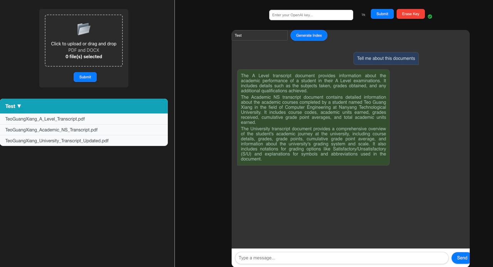

# Multi-Document Retriever and Reader (RAG) Model

## Description
This repository contains the implementation of a multi-document Retriever and Reader (RAG) model. The RAG model is a fusion of the retrieval-based and generative approaches to question answering. It retrieves relevant documents from a corpus and uses them to generate an answer to a given question.

## Features
- **Multi-Document Retrieval**: The model is capable of retrieving relevant documents from a large corpus, enabling it to handle complex queries that require information from multiple sources.
- **Generative Question Answering**: The model generates detailed and accurate answers to questions, leveraging the information retrieved from multiple documents.
- **Scalability**: The model is designed to be scalable and can handle large corpora and complex queries.

## Applications
The RAG model can be used in a variety of applications, including but not limited to:
- **Information Retrieval**: Retrieve relevant information from a large corpus based on a given query.
- **Question Answering**: Generate detailed and accurate answers to complex questions that require information from multiple documents.
- **Document Summarization**: Generate a summary of multiple documents based on a given query.

In this application, we will be using ```OpenAI``` models. Based on experience, currently not many open-source Large Language models are capable of agentic tasks and reasoning. Open-source LLMs such as [mixtral-8x22b](https://mistral.ai/news/mixtral-8x22b/) and [Llama-3](https://ai.meta.com/blog/meta-llama-3/) has shown to be capable to perform as agents.

## Tech Stack

This application is built with the following technologies:

- **Frontend**: [React](https://reactjs.org/)
- **Backend**: [FastAPI](https://fastapi.tiangolo.com/)
- **Database**: [MongoDB](https://www.mongodb.com/) is used to store documents and chat sessions.
- **Vector Storage**: [ChromaDB](https://chromadb.com/) is used for vector storage.
- **Framework**: [LlamaIndex](https://docs.llamaindex.ai/en/stable/)


## Getting Started

These instructions will get you a copy of the project up and running on your local machine for development and testing purposes.

### Prerequisites

- Docker: You need to have Docker installed on your machine. You can download and install Docker from the [official website](https://www.docker.com/get-started).
- Docker Compose: Docker Compose is included in the Docker Desktop installation for Windows and macOS. For Linux, you can follow the instructions on the [official documentation](https://docs.docker.com/compose/install/) to install it.
- OpenAI API Key: You would need a OpenAI API key to be able to called the [OpenAI API endpoint](https://openai.com/index/openai-api/). I paid for one and its pretty cheap if you used the cheaper models like ```gpt-3.5-turbo```.
- LlamaParse API Key: You would need a LlamaParse API Key to efficiently parse and represent the textual file. Free usage comes with page limit. Visit [official documentation](https://docs.cloud.llamaindex.ai/llamaparse/getting_started) for detailed documentation.

### Running the Application

1. Clone this repository to your local machine:

```bash
git clone https://github.com/GxTeo/Multi-Document-RAG.git
```

2. Navigate to the repo directory
```bash
cd /Multi-Document-RAG
```

3. Clone the chromadb repository 
```bash
git clone git@github.com:chroma-core/chroma.git
```

4. Build and start the services
```bash
docker-compose up --build
```

The command will start all the services defined in ```docker-compose.yaml```. By default, the backend can be accessible on port ```8005```,
the frontend on port ```3000```, mongodb on port ```27017``` and chromadb on port ```8000```. Feel free to change the port allocation based on your setup.

## Screenshots

Here is a screenshot of the application:




## Future Work

In the future, I plan to extend the capabilities of this application in the following ways:

- **Leverage Open Source Large Language Models (LLMs)**: I plan to incorporate more open-source LLMs to avoid reliance of OpenAI models and to provide more flexibility in terms of the models that can be used. I also wish that the application can be brought completely offline to avoid privacy issues

- **Multi-User Authentication**: I plan to add multi-user authentication to the application. This will allow multiple users to use the application simultaneously while maintaining their individual settings and data.

- **Change Vector Databases**: ChromaDB seems very unreliable, where we have methods breaking and poor documentation webpage. Maybe I would try FAISS or Redis in the near future.

- **Deployment on Google Kubernetes Engine (GKE)**: I plan to deploy the application on GKE. This will allow the application to scale to handle multiple users and to take advantage of the robustness and reliability of GKE.